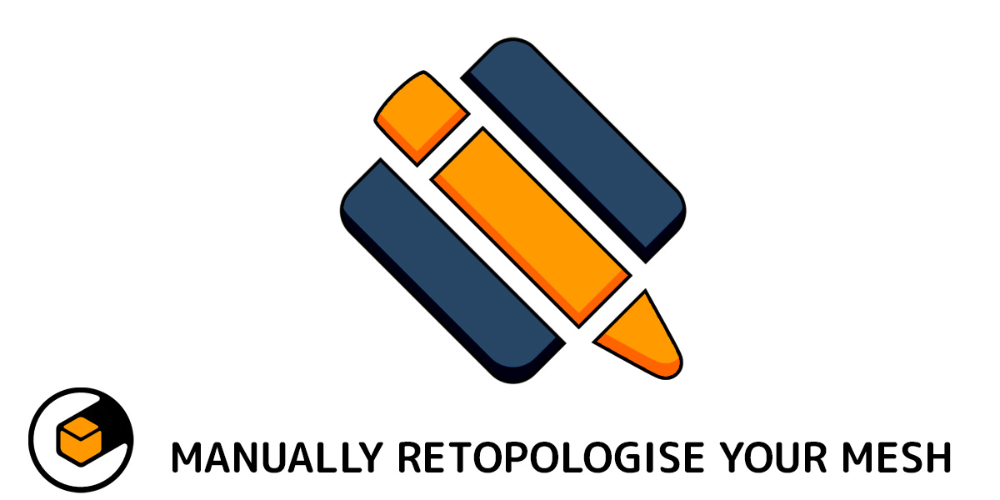

.. Quad Maker documentation master file, created by
   sphinx-quickstart on Wed Aug 14 10:59:00 2024.
   You can adapt this file completely to your liking, but it should at least
   contain the root `toctree` directive.

.. warning:: 
   Under Construction during the testing phase.

Quad Maker
======================================

---------------------------------
What is Quad Maker?
---------------------------------

  .. image:: _static/images/fill_quads.gif
     :alt: Fill Quads

Quad Maker is a set of Blender edit mode tools for 3D modelers that enables quick and efficient retopologizing of existing objects into quads. These tools are designed to work with each other to provide a faster retopology workflow than Blender's default, while seamlessly integrating with Blender's existing toolset.

Inspired by tools such as Maya's Quad Draw, Quad Maker aims to provide a similar experience for Blender users.

.. list-table::
   :widths: 50 50
   :header-rows: 0
   :align: center

   * - .. image:: _static/images/extrude_edges.gif
         :width: 100%
         :alt: Image 1

     - .. image:: _static/images/extrude_edges_ring.gif
         :width: 100%
         :alt: Image 2

   * - .. image:: _static/images/extrude_edge_ring_arm.gif
         :width: 100%
         :alt: Image 3

     - .. image:: _static/images/smooth_verts.gif
         :width: 100%
         :alt: Image 4

See the :ref:`Tools<Tools>` section for a breakdown of the tools available.

.. toctree::
   :maxdepth: 1
   :caption: Contents:
   
   installation
   quick_start
   workspace
   Tools <tools>
   troubleshooting
   contact