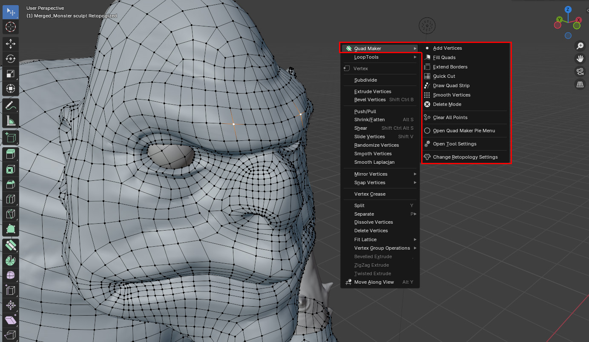

.. Quad Maker documentation master file, created by
   sphinx-quickstart on Wed Aug 14 10:59:00 2024.
   You can adapt this file completely to your liking, but it should at least
   contain the root `toctree` directive.

Quad Maker
======================================

.. image:: _static/images/logo-1_alpha.jpg
   :alt: Quad Maker

---------------------------------
What is Quad Maker?
---------------------------------

`Quad Maker <https://blendermarket.com/products/quad-maker/>`_ is a set of very simple Blender mesh operations designed to help 3D modelers quickly retopologize objects into clean, quad-based geometry. 

Inspired by Maya's Quad Draw, Quad Maker offers Blender users a way to speed up their retopology workflow while maintaining flexibility within Blender's existing toolset.

.. list-table::
   :widths: 50 50
   :header-rows: 0
   :align: center

   * - .. image:: _static/images/draw_quad_strip.gif
         :width: 100%
         :alt: Image 1

     - .. image:: _static/images/extrude_edges_ring.gif
         :width: 100%
         :alt: Image 2

   * - .. image:: _static/images/extrude_edge_ring_arm.gif
         :width: 100%
         :alt: Image 3

     - .. image:: _static/images/smooth_verts.gif
         :width: 100%
         :alt: Image 4

The operations are:

* :ref:`Add Vertices<add_vertices>`: Quickly add point vertices.
* :ref:`Fill Quads<fill_quads>`: Fill the point vertices and surrounding geometry with quads.
* :ref:`Extend Borders<extend_borders>`: Extrude border edges and vertices either in single, loop or edge rings.
* :ref:`Quick Cut<quick_cut>`: Quickly use the simple loop cut and slide operation with single clicks.
* :ref:`Draw Quad Strip<draw_quad_strip>`: Quickly draw out strips of quads on a target surface.
* :ref:`Smooth Vertices<smooth_verts>`: Smooth out vertices in edit mode.
* :ref:`Delete Mode<delete_mode>`: Quickly delete vertices, edges and faces and dissolve interior edges in a single click/drag operation.

With a focus on speed and simplicity, Quad Maker brings together these essential retopology operations into a unified, hotkey-driven workspace tool, aiming for seamless integration with Blender’s native mesh editing tools:

    Mesh courtesy of |Ryan Paul|

For maximum flexibility, each individual operation is also accessible through a simple right-click menu when in Blender's Edit Mode, giving users the choice to use the operations individually:

    Mesh courtesy of |Ryan Paul|

A Pie Menu is also available for quick access to the Quad Maker operations and settings:

    Mesh courtesy of |Ryan Paul|

Change Blender's retopology settings in one menu for easy access and customization:

    Mesh courtesy of |Ryan Paul|

.. |Ryan Paul| raw:: html

   <a href="https://www.artstation.com/ryankentpaule" target="_blank"><i>Ryan Paul</i></a>

Beware!
================

* The add-on is designed for simplicity and speed, so it may not be as feature-rich as other retopology tools.
* Check out the freely available `Poly Quilt <https://extensions.blender.org/add-ons/polyquilt-fork/>`_ and the excellent `Retopoflow <https://blendermarket.com/products/retopoflow>`_ add-on before deciding whether this add-on is for you.
* Please report any slow downs, bugs or issues by emailing `info@configurate.net <mailto:info@configurate.net>`_.
* Quad Maker should work well when retopologizing meshes with high poly counts but may not be suitable when editing high poly meshes themselves.

.. toctree::
   :maxdepth: 1
   :caption: Contents:
   
   installation
   quick_start
   Operations <operations>
   tool
   preferences
   troubleshooting
   contact

