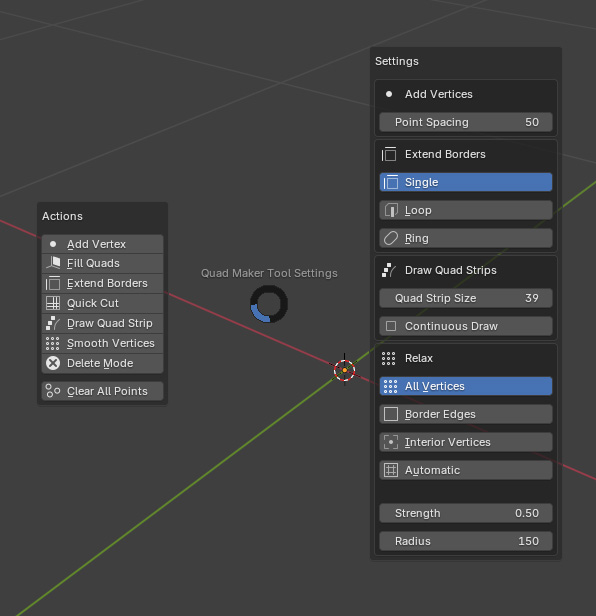

.. _operations:

#####################################
Operations
#####################################

----------------------------------------------------------------------

.. _add_vertices:

---------------------------------
Add Vertices
---------------------------------

:ref:`Tool Shortcut<tool>`: 

* ``[Hold V + Left Click]``

While Operation is Active:

* ``[Tap F / Up & Down Arrows]``: Change vertex draw spacing

  .. note::
    When using the :ref:`Tool Shortcut<tool>`, keep holding V to keep the operation active.

  .. image:: _static/images/place_points.gif
     :alt: Create Vertices

  Plan ahead by placing vertices onto a target surface ready to fill with quads.  
  
  By clicking and dragging you can also draw multiple vertices at once.

----------------------------------------------------------------------

.. _fill_quads:

---------------------------------
Fill Quads
---------------------------------

:ref:`Tool Shortcut<tool>`:

* ``[Hold F + Left Click + Drag]``

  .. image:: _static/images/fill_quads.gif
     :alt: Fill Quads

  .. image:: _static/images/fill_quads2.gif
     :alt: Fill Quads

  Fills in quads between points, edges, and holes in the geometry.

  .. tip::

        Also fills trianglular holes.

        .. image:: _static/images/fill_tris.gif
            :alt: Fill Quads

----------------------------------------------------------------------

.. _extend_borders:

---------------------------------
Extend Borders
---------------------------------

:ref:`Tool Shortcut<tool>`: 

* ``[Hold E and Left Click + Drag]``

While Operation is Active:

* ``[Tap Spacebar]``: Change Extend Mode (Single, Loop, Ring)

  .. note::
    When using the :ref:`Tool Shortcut<tool>`, keep holding E to keep the operation active.

  .. image:: _static/images/extrude_edges.gif
     :alt: Extend Borders

  Extrude border edges or create new faces from border points.

----------------------------------------------------------------------

.. _extrude_modes:

  **Extend Modes**

  .. tip::

    Change modes by pressing the spacebar or in the Tool Settings to select different types of edge selections:

        .. image:: _static/images/extrude_opts_menu.jpg
            :alt: Extrude Edge Options

----------------------------------------------------------------------

  * **Single Mode** - Extrude a single edge.

    .. image:: _static/images/extrude_edges_single.gif
        :alt: Extrude Single Edge

----------------------------------------------------------------------

  * **Edge Loop Mode** - Extrude a loop of edges.

    .. image:: _static/images/extrude_edges_loop.gif
        :alt: Extrude Edge Loop

----------------------------------------------------------------------

  * **Edge Ring Mode** - Extrude a ring of edges.

    .. image:: _static/images/extrude_edges_ring.gif
        :alt: Extrude Edge Ring

    .. image:: _static/images/extrude_edge_ring_arm.gif
        :alt: Extrude Edge Ring

----------------------------------------------------------------------

  * **Create Faces** - Click near a vertex to create a face.

    .. image:: _static/images/create_faces.gif
        :alt: Create Faces

----------------------------------------------------------------------

.. _quick_cut:

---------------------------------
Quick Loop Cut and Slide
---------------------------------

:ref:`Tool Shortcut<tool>`: 

* ``[Hold R + Left Click]``

  .. image:: _static/images/loop_cut_slide.gif
      :alt: Loop Cut and Slide

  Just by holding R and clicking the mouse over the edges.

----------------------------------------------------------------------

.. _draw_quad_strip:

---------------------------------
Draw Quad Strips
---------------------------------

:ref:`Tool Shortcut<tool>`: 

* ``[Hold D and Left Click + Drag]``

While Operation is Active:

* ``[Tap F / Up & Down Arrows]``: Change strip size

  .. note::
    When using the :ref:`Tool Shortcut<tool>`, keep holding D to keep the operation active.

  .. image:: _static/images/draw_quad_strip.gif
      :alt: Draw Quad Strips

  Click and move the mouse across the mesh to create a strip of quads.  Use the mouse wheel to adjust the size of the strip.

----------------------------------------------------------------------

.. _smooth_verts:

---------------------------------
Smooth Vertices
---------------------------------

:ref:`Tool Shortcut<tool>`: 

* ``[Hold S and Left Click + Drag]``

While Operation is Active:

* ``[Tap F / Up & Down Arrows]``: Change brush size

* ``[Shift + Tap F / Tap G / Left & Right Arrows]``: Change brush strength

* ``[Tap Spacebar]``: Change vertex relax mode (All, Border, Interior, Automatic)

  .. note::
    When using the :ref:`Tool Shortcut<tool>`, keep holding S to keep the operation active.

  .. image:: _static/images/smooth_verts.gif
      :alt: Smooth Elements

  Smooth vertices whilst maintaining their projection onto the target surface.

.. _smooth_modes:

    **Smooth Modes**

    * **All Vertices**: Smooth all vertices.
    * **Border Edges**: Smooth only border edge vertices.
    * **Interior Vertices**: Smooth only interior vertices.
    * **Automatic**: Automatically smooth vertices based on the initial selection.  If the initial selection is an interior vertex, only interior vertices will be relaxed. If the initial selection is a border vertex, only border vertices will be relaxed.

----------------------------------------------------------------------

.. _delete_mode:

---------------------------------
Delete Mode
---------------------------------

:ref:`Tool Shortcut<tool>`: 

* ``[Hold X and Left Click + Drag]``

  Delete Faces, Edge Loops, and lone Vertices. Quickly click and drag over a mesh to delete elements by holding X:

----------------------------------------------------------------------

  * **Delete Faces** - Click and drag over faces to delete them.

    .. image:: _static/images/delete_faces.gif
        :alt: Delete Faces

----------------------------------------------------------------------

  * **Dissolve/Delete Edge Loops** - Click and drag over edge loops to dissolve them. Boundary edge loops will be deleted.

    .. image:: _static/images/delete_edge_loops.gif
        :alt: Dissolve Edge Loops

----------------------------------------------------------------------

  * **Delete Lone Vertices** - Click and drag over vertices that have no edges to delete them.

    .. image:: _static/images/delete_verts.gif
        :alt: Delete Lone Vertices

----------------------------------------------------------------------

---------------------------------
Tweak Elements
---------------------------------

:ref:`Tool Shortcut<tool>`: 

* ``[Left Click + Drag]``

  .. image:: _static/images/tweak.gif
      :alt: Tweak Elements

  Move vertices, edges, and faces along the mesh.  ``Hold Alt + Left Click + Drag`` \* to select and move edge loops.

  .. note::

    \* When *Emulate 3 Button Mouse* is selected in preferences and the Alt key is used for the middle mouse,  ``Hold Shift + Left Click + Drag`` to select and move edge loops instead.

----------------------------------------------------------------------

.. _pie_menu:

-----------------
Pie Menu
-----------------

:ref:`Tool Shortcut<tool>`: 

* ``[Press Q]``

A Pie Menu is available either via the right-click Quad Maker edit mode menu or by pressing the *Q key* when using the main tool.  This menu gives you quick access to the Quad Maker operations and settings:

.. important::

    Remember when you have finished with each operation, *right-click* again or press the *escape key* to exit.

.. tip::
    
        You can bind the pie menu to a short cut by right-clicking the Pie Menu option in the Quad Maker right-click menu and selecting *Assign Shortcut* or clicking on *Add to Quick Favorites* to quickly access it as a Favorite by pressing *Q*.  Please note that not all hotkeys work depending on what you are doing in Blender.

----------------------------------------------------------------------