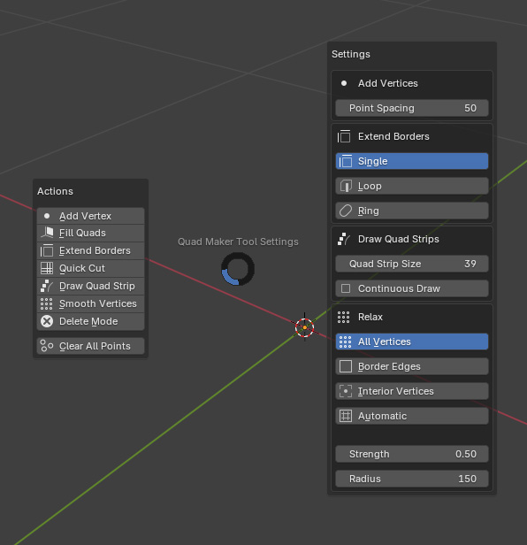

.. _operations:

#####################################
Operations
#####################################

----------------------------------------------------------------------

.. _add_vertices:

---------------------------------
Add Vertices
---------------------------------

:ref:`Tool Shortcut<tool>`: 

* ``[Hold V + Left Click]``

While Operation is Active:

* ``[Tap F / Up & Down Arrows]``: Change vertex draw spacing

  .. note::
    When using the :ref:`Tool Shortcut<tool>`, keep holding V to keep the operation active.

  .. image:: _static/images/place_points.gif
     :alt: Create Vertices

  Plan ahead by placing vertices onto a target surface ready to fill with quads.  
  
  By clicking and dragging you can also draw multiple vertices at once.

----------------------------------------------------------------------

.. _fill_quads:

---------------------------------
Fill Quads
---------------------------------

:ref:`Tool Shortcut<tool>`:

* ``[Hold F + Left Click + Drag]``

  .. image:: _static/images/fill_quads.gif
     :alt: Fill Quads

  .. image:: _static/images/fill_quads2.gif
     :alt: Fill Quads

  Fills in quads between points, edges, and holes in the geometry.

  .. tip::

        Also fills trianglular holes.

        .. image:: _static/images/fill_tris.gif
            :alt: Fill Quads

----------------------------------------------------------------------

.. _extend_borders:

---------------------------------
Extend Borders
---------------------------------

:ref:`Tool Shortcut<tool>`: 

* ``[Hold E and Left Click + Drag]``

While Operation is Active:

* ``[Tap Spacebar]``: Change Extend Mode (Single, Loop, Ring)

  .. note::
    When using the :ref:`Tool Shortcut<tool>`, keep holding E to keep the operation active.

  .. image:: _static/images/extrude_edges.gif
     :alt: Extend Borders

  Extrude border edges or create new faces from border points.

----------------------------------------------------------------------

.. _extrude_modes:

  **Extend Modes**

  .. tip::

    Change modes by pressing the spacebar or in the Tool Settings to select different types of edge selections:

        .. image:: _static/images/extrude_opts_menu.jpg
            :alt: Extrude Edge Options

----------------------------------------------------------------------

  * **Single Mode** - Extrude a single edge.

    .. image:: _static/images/extrude_edges_single.gif
        :alt: Extrude Single Edge

----------------------------------------------------------------------

  * **Edge Loop Mode** - Extrude a loop of edges.

    .. image:: _static/images/extrude_edges_loop.gif
        :alt: Extrude Edge Loop

----------------------------------------------------------------------

  * **Edge Ring Mode** - Extrude a ring of edges.

    .. image:: _static/images/extrude_edges_ring.gif
        :alt: Extrude Edge Ring

    .. image:: _static/images/extrude_edge_ring_arm.gif
        :alt: Extrude Edge Ring

----------------------------------------------------------------------

  * **Create Faces** - Click near a vertex to create a face.

    .. image:: _static/images/create_faces.gif
        :alt: Create Faces

----------------------------------------------------------------------

.. _quick_cut:

---------------------------------
Quick Loop Cut and Slide
---------------------------------

:ref:`Tool Shortcut<tool>`: 

* ``[Hold R + Left Click]``

  .. image:: _static/images/loop_cut_slide.gif
      :alt: Loop Cut and Slide

  Just by holding R and clicking the mouse over the edges.

  The preview shows the new edge loop and the vertices it will create, so you can see exactly where the cut will go before you click.  The color of the preview vertices can be changed in the :ref:`preferences<color_settings>` (*Edge Slice Vertex Color*).

----------------------------------------------------------------------

.. _draw_quad_strip:

---------------------------------
Draw Quads
---------------------------------

:ref:`Tool Shortcut<tool>`:

* ``[Hold D and Left Click + Drag]``

While Operation is Active:

* ``[F]``: Enter size adjust mode, then move the mouse to change the strip size. Left click to confirm, right click to cancel.
* ``[Up Arrow / Right Bracket]``: Increase strip size by one step
* ``[Down Arrow / Left Bracket]``: Decrease strip size by one step
* ``[Spacebar]``: Toggle between Strip and Ring mode

  .. note::
    When using the :ref:`Tool Shortcut<tool>`, keep holding D to keep the operation active.

  Draw Quads has two modes, toggled with ``Spacebar``:

----------------------------------------------------------------------

.. _draw_quad_strips_mode:

  **Strip Mode**

  .. image:: _static/images/draw_quad_strip.gif
      :alt: Draw Quad Strips

  Click and move the mouse across the mesh to paint a freehand strip of quads onto the surface. Use the mouse wheel to adjust the size of the strip.

----------------------------------------------------------------------

.. _draw_place_ring_mode:

  **Place Ring Mode**

  .. image:: _static/images/place_ring_overview.gif
      :alt: Place Ring

  Click a handful of points to define a path, then build a ring-based sleeve of quads along the fitted curve, ideal for retopologizing arms, legs, fingers, and other tube-like shapes where you want to review and adjust the path before committing. See :ref:`Place Ring<place_ring_mode>` for full details.

  .. toctree::
     :maxdepth: 1

     place_ring_mode

----------------------------------------------------------------------

.. _smooth_verts:

---------------------------------
Smooth Vertices
---------------------------------

:ref:`Tool Shortcut<tool>`: 

* ``[Hold S and Left Click + Drag]``

While Operation is Active:

* ``[Tap F / Up & Down Arrows]``: Change brush size

* ``[Shift + Tap F / Tap G / Left & Right Arrows]``: Change brush strength

* ``[Tap Spacebar]``: Change vertex relax mode (All, Selected,sssssss Border, Interior, Automatic)

  .. note::
    When using the :ref:`Tool Shortcut<tool>`, keep holding S to keep the operation active.

  .. image:: _static/images/smooth_verts.gif
      :alt: Smooth Elements

  Smooth vertices whilst maintaining their projection onto the target surface.

.. _smooth_modes:

    **Smooth Modes**

    * **All Vertices**: Smooth all vertices.
    * **Selected Vertices**: Smooth only selected vertices.
    * **Border Edges**: Smooth only border edge vertices.
    * **Interior Vertices**: Smooth only interior vertices.
    * **Automatic**: Automatically smooth vertices based on the initial selection.  If the initial selection is an interior vertex, only interior vertices will be relaxed. If the initial selection is a border vertex, only border vertices will be relaxed.

----------------------------------------------------------------------

.. _delete_mode:

---------------------------------
Delete Mode
---------------------------------

:ref:`Tool Shortcut<tool>`: 

* ``[Hold X and Left Click + Drag]``

  Delete Faces, Edge Loops, and Vertices. Quickly click and drag over a mesh to delete elements by holding X:

----------------------------------------------------------------------

  * **Delete Faces** - Click and drag over faces to delete them.

    .. image:: _static/images/delete_faces.gif
        :alt: Delete Faces

----------------------------------------------------------------------

  * **Dissolve/Delete Edge Loops** - Click and drag over edge loops to dissolve them. Boundary edge loops will be deleted.

    .. image:: _static/images/delete_edge_loops.gif
        :alt: Dissolve Edge Loops

----------------------------------------------------------------------

  * **Delete Vertices** - Hover over any vertex to pick it, then click to remove it.  Vertices that are part of faces are dissolved, keeping the surrounding faces; lone vertices with no edges are deleted.

    .. image:: _static/images/delete_verts.gif
        :alt: Delete Vertices

----------------------------------------------------------------------

.. _tweak_elements:

---------------------------------
Tweak Elements
---------------------------------

:ref:`Tool Shortcut<tool>`:

* ``[Left Click + Drag]``

  .. image:: _static/images/tweak.gif
      :alt: Tweak Elements

  Move vertices, edges, and faces along the mesh.  ``Hold Alt + Left Click + Drag`` \* to select and move edge loops.

  .. note::

    \* When *Emulate 3 Button Mouse* is selected in preferences and the Alt key is used for the middle mouse,  ``Hold Shift + Left Click + Drag`` to select and move edge loops instead.

.. _proportional_tweak:

  **Proportional Tweak**

  Turn on proportional editing as usual with ``O`` (or from the :ref:`Proportional Tweak<tool_settings>` tool settings) and drag a vertex: nearby vertices follow with a smooth falloff.

  Unlike Blender's built-in proportional editing, the falloff is measured **on screen**, and **vertices you can't see are left alone**.  Grabbing a vertex on a thin surface, such as clothing, an ear or an eyelid, no longer drags the vertices on the other side with it, and nothing hidden behind another part of the model moves either.

  While dragging:

  * ``[Mouse Wheel / Page Up & Page Down]``: Change the proportional size.  Hold ``Shift`` for finer steps.  Any keys you have remapped for Blender's proportional editing also work.

  Everything else works the way it does in Blender:

  * **Proportional Size** is Blender's own setting, shown as the same circle around the selection.
  * Blender's **falloff types** and **Connected Only** option are used.
  * **Exclude Occluded** leaves out vertices that face away from the view or are hidden behind the target object.  It is on by default, and is ignored in X-Ray.
  * After a tweak, the **Adjust Last Operation** panel lets you change the move, the proportional size, falloff and other options, as with Blender's Move.

  .. tip::

    To use Blender's built-in proportional editing instead, turn off :ref:`Screen Space Proportional Editing<screen_space_proportional_editing>` in the add-on preferences.

----------------------------------------------------------------------

.. _pie_menu:

-----------------
Pie Menu
-----------------

:ref:`Tool Shortcut<tool>`: 

* ``[Press Q]``

A Pie Menu is available either via the right-click Quad Maker edit mode menu or by pressing the *Q key* when using the main tool.  This menu gives you quick access to the Quad Maker operations and settings:

.. important::

    Remember when you have finished with each operation, *right-click* again or press the *escape key* to exit.

.. tip::
    
        You can bind the pie menu to a short cut by right-clicking the Pie Menu option in the Quad Maker right-click menu and selecting *Assign Shortcut* or clicking on *Add to Quick Favorites* to quickly access it as a Favorite by pressing *Q*.  Please note that not all hotkeys work depending on what you are doing in Blender.
