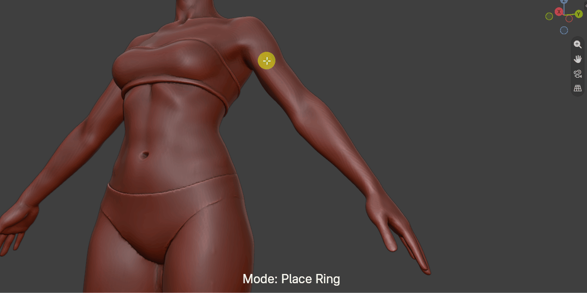
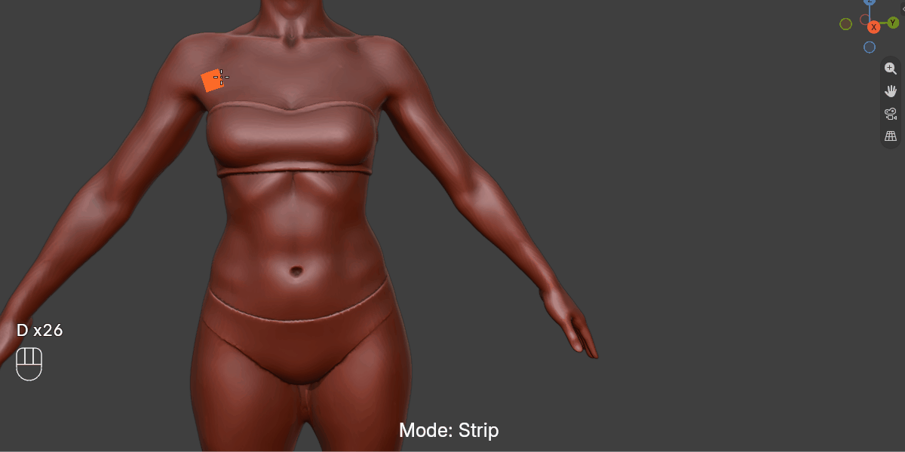
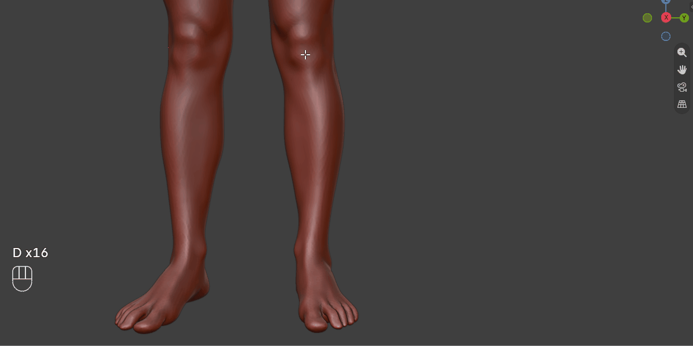
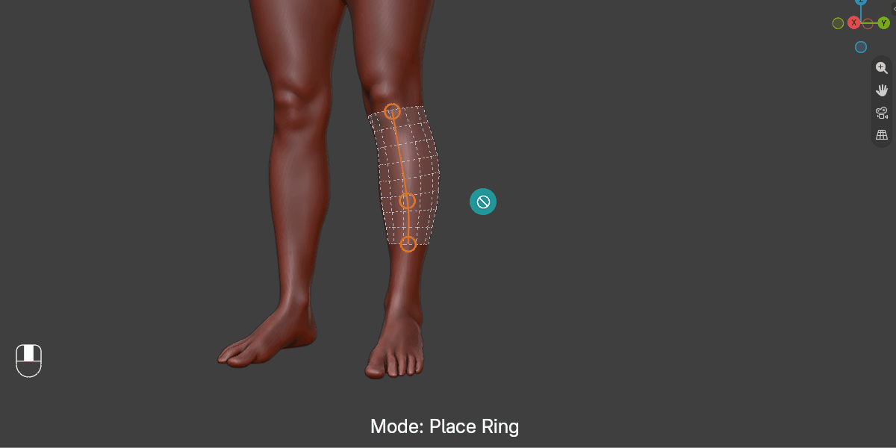
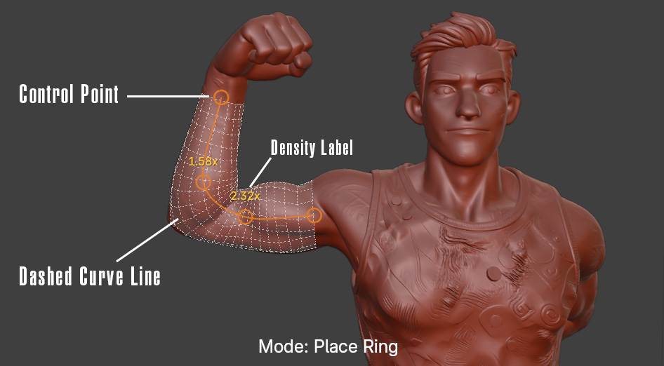
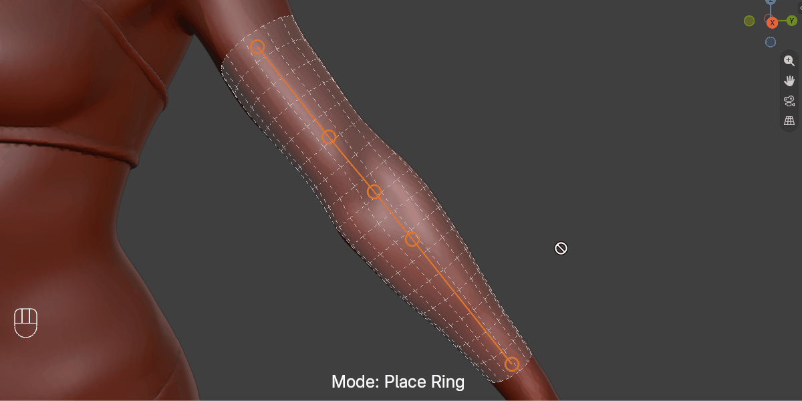
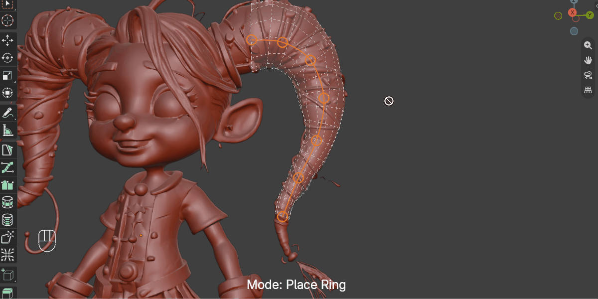
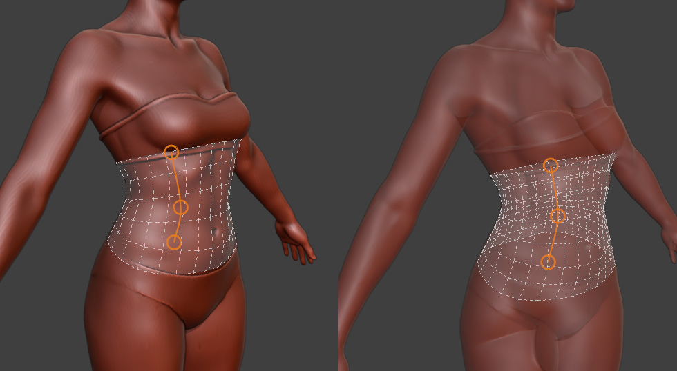

.. _place_ring_mode:

#####################################
Place Ring
#####################################

Place Ring is an alternative drawing mode for the :ref:`Draw Quads<draw_quad_strip>` operation. Instead of freely painting a strip of quads or dragging continuously along the surface, you click a handful of points to define a path, then the tool fits a smooth curve through them and builds a ring-based sleeve of quads along it. This gives you deliberate control over where each ring lands before any geometry is created, making it ideal for retopologizing tube-like forms such as arms, legs, fingers, and torsos.

.. note::

   *Placeholder: animated GIF showing a full Place Ring session — clicking several points across a limb, finishing placement, and committing the geometry.*

----------------------------------------------------------------------

---------------------------------
When to Use Place Ring
---------------------------------

Place Ring works best when you are retopologizing:

* **Cylindrical or tube-like forms** such as arms, legs, fingers, and necks, especially where the form bends or winds — a few well-placed points describe a curve more predictably than a continuous drag.
* **Paths where you want to check the result before committing.** Because placement and editing are separate phases, you can reposition, insert, or delete points and watch the preview update before any geometry is created.
* **Limbs that need varying loop density**, for example denser loops near a joint for better deformation — see :ref:`Per-Point Loop Density<place_ring_mode_density>`.

For flat or planar surfaces, the standard :ref:`Draw Quad Strips mode<draw_quad_strips_mode>` is usually more appropriate.

----------------------------------------------------------------------

---------------------------------
Switching to Place Ring Mode
---------------------------------

While the :ref:`Draw Quads<draw_quad_strip>` operation is active, press **Spacebar** to cycle between *Strip* and *Place Ring* mode. The current mode is displayed in the status bar at the bottom of the viewport.

.. note::

   *Placeholder: animated GIF showing Spacebar toggling between Strip and Place Ring mode, with the status bar text changing.*

You can also set Place Ring as the default in the :ref:`Tool Settings<tool_settings>` so it is always active when you begin a Draw Quads session.

----------------------------------------------------------------------

.. _place_ring_mode_usage:

---------------------------------
Placing Points
---------------------------------

.. note::

   *Placeholder: animated GIF showing several points being clicked across a curved limb, with the live preview curve updating as the mouse moves before each click.*

#. **Activate Draw Quads** by holding ``D`` (or clicking the operation in the right-click menu).

#. **Switch to Place Ring mode** by pressing ``Spacebar`` if it is not already active.

#. **Click** on the retopology mesh to place your first point. A live preview line will track the mouse from that point, showing where the next point will land.

#. **Continue clicking** to add more points along the path you want the sleeve to follow. Each click adds a point; the preview curve updates through all placed points plus the live point under the mouse.

   .. tip::

      You don't need many points — a handful placed at the start, end, and any bends is usually enough. The curve is fitted smoothly through them.

#. **Finish placement** with a **double-click**, ``Enter``, or ``Right Click`` (the latter two require at least 2 points already placed). A double-click adds one final point at the cursor before finishing; Enter and Right Click finish without adding a pending point.

Finishing placement does not create any geometry yet — it moves you into the editing phase below, where you can review and adjust the whole path first.

----------------------------------------------------------------------

.. _place_ring_mode_editing:

---------------------------------
Editing the Path
---------------------------------

.. note::

   *Placeholder: animated GIF showing a placed path being edited — dragging a point, inserting a point by clicking the curve, and extending from an end with Ctrl+Click.*

Once placement is finished, the path can be freely adjusted before it is committed to geometry:

* **Drag an existing point** by clicking and holding on it, then moving the mouse. The point follows the cursor in screen space at its current depth.
* **Insert a new point** by clicking anywhere on the curve between two existing points (not on a point itself).
* **Extend the path** by holding ``Ctrl`` and clicking away from the path — this adds a new point at whichever end (start or finish) is closer to your click.
* **Delete a point** by holding ``X`` (or ``Del`` / ``Backspace``) and clicking on it — see :ref:`Deleting and Inserting Points<place_ring_mode_delete>` below. At least 2 points must remain.
* **Adjust loop density** for the nearest point with ``Shift + F`` — see :ref:`Per-Point Loop Density<place_ring_mode_density>`.

When you're happy with the path, **double-click** or press ``Enter`` to commit the geometry.

----------------------------------------------------------------------

---------------------------------
Preview Indicators
---------------------------------

While placing or editing in Place Ring mode, several visual indicators help you understand the current state:

.. list-table::
   :widths: 25 75
   :header-rows: 1

   * - Indicator
     - Meaning
   * - **Hollow circles**
     - Each already-placed control point.
   * - **Dashed curve line**
     - The fitted path connecting your control points — dashed to distinguish Place Ring's preview from the solid line used by Strip mode.
   * - **Live point (while placing)**
     - The pending point that follows the mouse before your next click.
   * - **Amber density label**
     - Shown above any point whose loop density has been adjusted away from its default with ``Shift + F``.
   * - **Crosshair cursor**
     - Shown while hovering a valid surface to place or insert a point.
   * - **Grab cursor**
     - Shown while hovering an existing point that can be dragged, or while a point is being dragged.
   * - **Eraser cursor**
     - Shown while holding ``X`` / ``Del`` / ``Backspace`` over a point that can be deleted.
   * - **Stop cursor**
     - Shown when the mouse is not over any hittable surface, or when holding the delete key with no valid point under the cursor.

.. note::

   *Placeholder: annotated screenshot pointing out the control point circles, dashed curve, and density label on an in-progress path.*

----------------------------------------------------------------------

.. _place_ring_mode_controls:

---------------------------------
Controls
---------------------------------

**While Placing Points**

.. list-table::
   :widths: 30 70
   :header-rows: 1

   * - Input
     - Action
   * - ``Left Click``
     - Add another point.
   * - ``Double Click``
     - Add a final point at the cursor and finish placement.
   * - ``Enter`` / ``Right Click``
     - Finish placement without adding a pending point (requires 2+ points already placed).
   * - ``Ctrl + Z``
     - Undo the last placed point. Undoing the first point cancels back to no path.
   * - ``F`` then move mouse
     - Enter size adjust mode. Move the mouse to change the ring size, left click to confirm, right click to cancel.
   * - ``Escape``
     - Cancel the whole path.
   * - ``Spacebar``
     - Toggle between Strip and Place Ring mode. Disabled while a path is in progress, so an accidental press cannot discard your points.

**While Editing**

.. list-table::
   :widths: 30 70
   :header-rows: 1

   * - Input
     - Action
   * - ``Double Click`` / ``Enter``
     - Commit the path as geometry.
   * - ``Drag a Point``
     - Reposition it.
   * - ``Click the Curve``
     - Insert a new point at that position.
   * - ``Ctrl + Click``
     - Extend the path from whichever end is nearer the click.
   * - ``Hold X`` (or ``Del`` / ``Backspace``) ``+ Click a Point``
     - Delete that point (minimum 2 points enforced).
   * - ``Shift + F``
     - Adjust loop density at the point nearest the mouse (see :ref:`Per-Point Loop Density<place_ring_mode_density>`).
   * - ``Escape`` / ``Right Click``
     - Cancel the whole path.

.. note::

   ``Ctrl + Z`` is intentionally disabled during editing, since point order isn't visible at this stage and a single undo previously discarded the whole path by accident. Use ``Escape`` to cancel everything, or hold ``X`` and click a point to remove just that one.

----------------------------------------------------------------------

.. _place_ring_mode_density:

---------------------------------
Per-Point Loop Density
---------------------------------

Each control point has its own loop density, letting you pack rings more tightly near a bend (for example, around an elbow or knuckle for better deformation) without affecting the rest of the sleeve.

* While editing, press ``Shift + F`` to adjust the density of the point nearest the mouse, then move the mouse left or right to increase or decrease it.
* Press ``[1]`` to reset the point back to its default density.
* Press ``Right Click`` to cancel and revert to the previous value.
* Points with a non-default density show an amber label above them in the viewport.

.. note::

   *Placeholder: animated GIF showing Shift+F increasing density near one point, with rings visibly packing closer together around it.*

----------------------------------------------------------------------

.. _place_ring_mode_delete:

---------------------------------
Deleting and Inserting Points
---------------------------------

Deleting a point requires a deliberate two-part gesture rather than a single keypress, so that resting a finger on ``X`` while editing can't silently remove a point:

#. **Hold** ``X`` (or ``Del`` / ``Backspace``). The cursor changes to an eraser when hovering a point that can be deleted, or a stop icon everywhere else.
#. **Click** on the point to remove it, or release the key without clicking to change your mind.

.. note::

   *Placeholder: animated GIF showing X held down (eraser cursor appearing over a point), then clicking to delete it, and the sleeve preview reflowing through the remaining points.*

Inserting a point is a single click: click anywhere on the dashed curve between two existing points, away from any point itself, and a new point is added there, splitting the segment.

----------------------------------------------------------------------

---------------------------------
X-Ray Mode
---------------------------------

When Blender's **Show X-Ray** viewport option is enabled, the ring preview is drawn on both front- and back-facing geometry. This lets you see and work on the full sleeve even when parts of it are obscured by the mesh.

.. note::

   *Placeholder: side-by-side screenshot comparing the Place Ring preview in normal mode and X-Ray mode.*

----------------------------------------------------------------------

.. _place_ring_mode_target:

---------------------------------
Target Object
---------------------------------

Place Ring honours the :ref:`Target Object<tool_settings>` setting in the same way as the rest of Quad Maker:

* **With a Target Object set:** all raycasts project onto that object's surface, giving the most accurate and fastest results. The target object's scale does **not** need to be applied.
* **Without a Target Object:** Place Ring will cast rays against all visible scene objects. This is slower but still works correctly.

.. tip::

   For best results, set a target object before starting a Place Ring session. See :ref:`Getting Started<quick_start>` for how to set up your retopology workspace.

----------------------------------------------------------------------

---------------------------------
Known Limitations
---------------------------------

* **Ambiguous joints:** at a point placed directly on a shoulder or similarly ambiguous joint, there is no clear "far wall" for the ring to measure against, so the resulting ring may be larger than expected. This is a predictable, local artifact rather than a bug — if it happens, try moving the point slightly or adding an extra point either side of the joint.

* **Grazing view angles:** each point's depth is found by probing along the camera's view ray. At very shallow, near-tangential viewing angles, that probe can in rare cases skim past the intended surface and land on unrelated geometry further away. Rotating the view before placing or adjusting a point resolves this.

* **View-dependent preview:** because a point's depth comes from the view ray at the moment it's placed, the preview can look different after rotating the view, even though nothing has moved — only the point's on-screen position is guaranteed to stay put. This settles down once you rotate to inspect the result.

* **Open ends:** a committed sleeve is always open at both ends; there is currently no option to cap an end (for example, at a finger tip).

----------------------------------------------------------------------

---------------------------------
Tips
---------------------------------

.. tip::

   Place fewer points along straight sections and add extra points at bends — the curve is fitted through them, so bends need points to describe them but straight runs don't.

.. tip::

   Use ``Ctrl + Click`` in the editing phase to extend a path you've already placed, instead of cancelling and starting over.

.. tip::

   Increase :ref:`loop density<place_ring_mode_density>` near a joint if you plan to rig and deform the mesh afterwards.

.. tip::

   Use the :ref:`Smooth Vertices<smooth_verts>` operation after committing a Place Ring sleeve to even out any unevenness in the resulting geometry.
