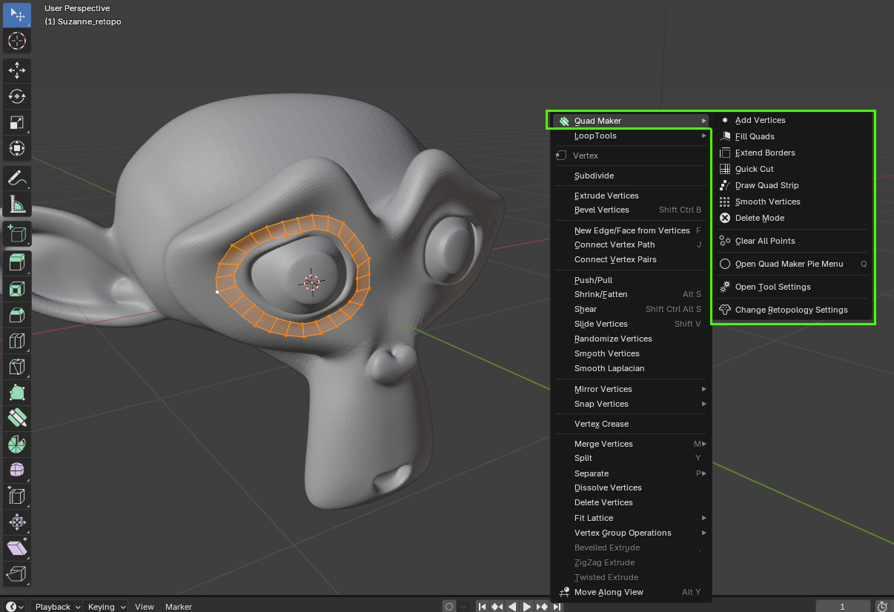
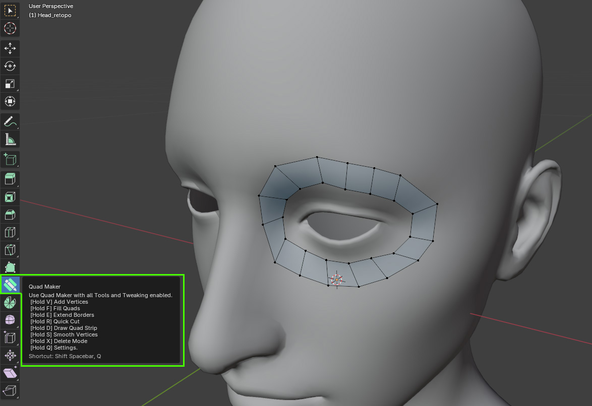

.. _quick_start:

#################
Get Started
#################

Once you have :ref:`installed<installation>` the add-on, you can choose to access Quad Maker's :ref:`operations<operations>` in different ways when in Blender's `Edit Mode <https://docs.blender.org/manual/en/latest/editors/3dview/modes.html>`_:

* :ref:`right_click_menu`: use each operation **individually**.
* :ref:`combined_tool`: use all operations **together**.

You can also choose to quickly set up your retopology environment by :ref:`creating a new blank mesh<new_blank_mesh>`  with the main tool automatically selected and Blender's retopology settings automatically applied.

.. _right_click_menu:

-----------------
Right Click Menu
-----------------

The simplest way to access Quad Maker's :ref:`operations<operations>` is to right-click any time in Blender's `Edit Mode <https://docs.blender.org/manual/en/latest/editors/3dview/modes.html>`_ to access each :ref:`operation<operations>` individually.

This gives you the option of using Quad Maker at any point in your existing workflow whenever you are in Blender's `Edit Mode <https://docs.blender.org/manual/en/latest/editors/3dview/modes.html>`_:

.. important::

    When you have finished with each menu operation, *right-click* again or press the *escape key* to exit.

.. tip::

    .. image:: _static/images/menu_edit_mode.jpg
       :alt: Right Click Menu

    If you see this menu instead, this means you are in Blender's `Object Mode <https://docs.blender.org/manual/en/latest/editors/3dview/modes.html>`_.  Select 'Enter Edit Mode' to switch to object mode and see Quad Makers :ref:`operations<operations>` in the menu.

It can however be difficult to use the :ref:`operations<operations>` fluently together in this way.

To quickly use Quad Maker's :ref:`operations<operations>` *together*, use the :ref:`main tool<combined_tool>` described below.

.. _combined_tool:

-----------------
Main Tool
-----------------

The quickest way to use Quad Maker is by using the :ref:`main interactive tool<tool>` in edit mode which binds all :ref:`operations<operations>` to :ref:`keyboard shortcuts<keyboard_shortcuts>` whilst the tool is selected. Select this tool in edit mode by clicking on the quad maker icon in the tool menu on the left hand side of the viewport:

You can swap in and out of the Quad Maker tool at any time by clicking the different tools on the left hand side of the viewport.

.. tip::

    Press the *W key* to go back to the default Blender selection tool at any time.

.. _new_blank_mesh:

Creating a new blank mesh for retopology
============================================

.. image:: _static/images/quick_start.gif
   :alt: Quick Start

You can optionally create a new blank mesh and automatically select the Quad Maker tool for retopology by taking the following steps:

#. With the object you wish to retopologize selected in Blender's `Object Mode <https://docs.blender.org/manual/en/latest/editors/3dview/modes.html>`_, click the Quad Maker icon along the top of the viewport.

    .. image:: _static/images/quad_maker_menu.jpg
       :alt: Quick Start 1

#. Select **Add New Object with Quad Maker** option from the dropdown menu.

    .. image:: _static/images/quad_maker_menu_submenu.jpg
       :alt: Quick Start 2

#. This option will automatically:

    #. Create a new blank object called *\<Object Name\> Retopologized*.

    #. Select this new blank object.

    #. Enter Edit Mode.

    #. Enable the Quad Maker tool on the left hand side of the viewport.

        .. image:: _static/images/quad_maker_tool_side.jpg
           :alt: Quick Start 2

    #. Set the target object to the originally selected object.

        .. image:: _static/images/target_object_dropdown.jpg
           :alt: Quick Start 3

    #. Enable preset Blender retopology settings.

        .. image:: _static/images/retopolo_menu.jpg
           :alt: Quick Start 4

    .. tip::

        You can always perform these steps manually if you wish.

#. You can then start retopologizing your object using the :ref:`Quad Maker operations<operations>`.

#. You can exit and re-enter the tool simply by selecting another tool from the side menu, or exiting Edit Mode by pressing the *tab* key.

    .. note::

        There is nothing 'special' about the new object created by the *Add New Object with Quad Maker* option.  It is simply a blank object with the Quad Maker tool enabled.  You can use this object as you would any other object in Blender.

If you have any issues, please do not hesitate to :ref:`Contact Us <contact>`.

    

