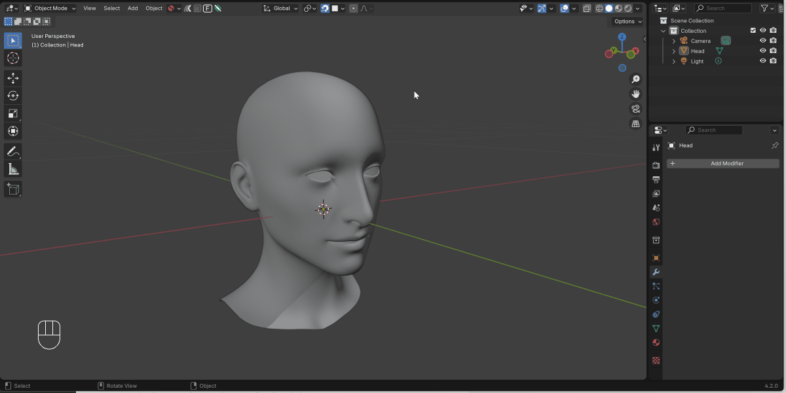

.. _quick_start:

#################
Quick Start
#################

Once you have :ref:`installed<installation>` the add-on, take the following steps:

#. With the object you wish to retopologize selected, click the Quad Maker icon along the top of the viewport.

    .. image:: _static/images/quad_maker_menu.jpg
       :alt: Quick Start 1

#. Select **New Object with Quad Maker** option from the dropdown menu.

    .. image:: _static/images/quad_maker_menu_submenu.jpg
       :alt: Quick Start 2

#. This option will automatically:

    #. Create a new blank object called *\<Object Name\> Retopologized*.

    #. Select this new blank object.

    #. Enter Edit Mode.

    #. Enable the the Quad Maker toolset on the left hand side of the viewport.

        .. image:: _static/images/quad_maker_tool_side.jpg
           :alt: Quick Start 2

    #. Set the target object to the originally selected object.

        .. image:: _static/images/target_object_dropdown.jpg
           :alt: Quick Start 3

    #. Enable default retopology settings (press ALT whilst clicking the Quad Maker icon to ignore this step).

        .. image:: _static/images/retopolo_menu.jpg
           :alt: Quick Start 4

    .. tip::

        You can always perform these steps manually if you wish.

#. You can then start retopologizing your object using the :ref:`Quad Maker toolset<tools>`.

    .. tip::

        You can exit and re-enter the tools simply by selecting another tool from the side menu, or by exiting Edit Mode.
