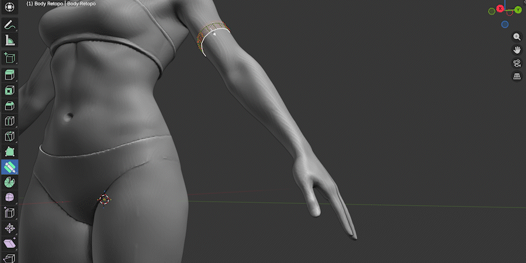
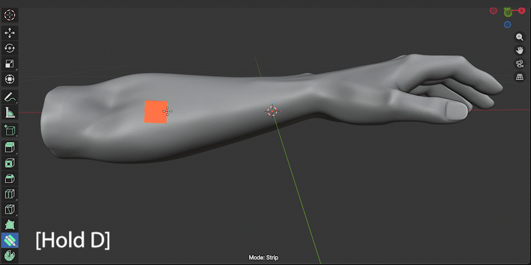
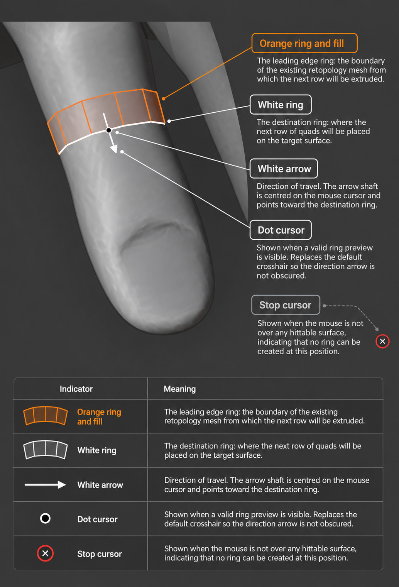
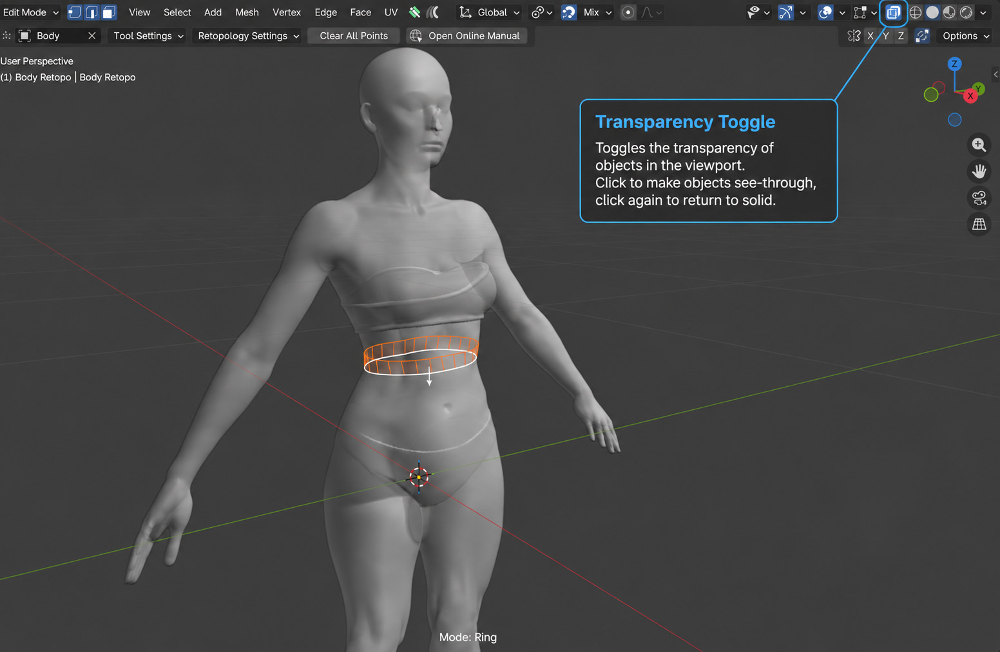

.. _ring_mode:

#####################################
Draw Quad Rings
#####################################

Draw Quad Rings is an alternative drawing mode for the :ref:`Draw Quads<draw_quad_strip>` operation. Instead of freely painting a strip of quads across the surface, it builds rings of connected quads that follow the contours of a target mesh, ideal for retopologizing cylindrical forms such as arms, legs, fingers, and torsos.

.. note::

   *Placeholder: replace with an animated GIF showing rings being drawn around a cylindrical limb.*

----------------------------------------------------------------------

---------------------------------
When to Use Draw Quad Rings
---------------------------------

Draw Quad Rings works best when you are retopologizing:

* **Cylindrical or tube-like forms** such as arms, legs, fingers, and necks.
* **Organic loops** around muscle masses, facial features, or any area where you want evenly-spaced edge rings following the contour of the surface.

For flat or planar surfaces, the standard :ref:`Draw Quad Strips<draw_quad_strip>` mode is usually more appropriate.

----------------------------------------------------------------------

---------------------------------
Switching to Ring Mode
---------------------------------

While the :ref:`Draw Quads<draw_quad_strip>` operation is active, press **Spacebar** to cycle between *Strip* and *Ring* mode. The current mode is displayed in the status bar at the bottom of the viewport.

.. image:: _static/images/ring_mode_toggle.jpg
   :alt: Toggling Ring Mode

.. note::

   *Placeholder: screenshot of the mode indicator in the status bar and the top menu showing the active mode.*

You can also set Ring mode as the default in the :ref:`Tool Settings<tool_settings>` so it is always active when you begin a Draw Quads session.

----------------------------------------------------------------------

.. _ring_mode_usage:

---------------------------------
Using Draw Quad Rings
---------------------------------

.. note::

   *Placeholder: animated GIF showing the full click-and-drag workflow on an arm mesh.*

#. **Activate Draw Quads** by holding ``D`` (or clicking the operation in the right-click menu).

#. **Switch to Ring mode** by pressing ``Spacebar`` if it is not already active.

#. **Hover** over the retopology mesh. A preview will appear showing the ring that will be created and the direction of travel.

   * The **orange ring** shows the current leading edge (where you are starting from).
   * The **white ring** shows where the next row of quads will land on the target surface.
   * A **white arrow** tracks the mouse cursor and indicates the direction the rings will extend when you drag.

   .. image:: _static/images/ring_mode_preview.jpg
      :alt: Ring Mode Preview

   .. note::

      *Placeholder: screenshot showing the orange ring, white ring, and direction arrow on a mesh.*

#. **Click and drag** in the direction you want the rings to extend. Hold the mouse button and drag along the surface; new rings of quads are stitched automatically as you move.

   .. tip::

      Drag along the length of the form (for example, down an arm) rather than around it. Draw Quad Rings extrudes new rings perpendicular to the drag direction.

#. **Release** the mouse button to stop adding rings and commit the geometry.

----------------------------------------------------------------------

---------------------------------
Preview Indicators
---------------------------------

While hovering in Ring mode, several visual indicators help you understand where geometry will be created:

.. list-table::
   :widths: 25 75
   :header-rows: 1

   * - Indicator
     - Meaning
   * - **Orange ring and fill**
     - The leading edge ring: the boundary of the existing retopology mesh from which the next row will be extruded.
   * - **White ring**
     - The destination ring: where the next row of quads will be placed on the target surface.
   * - **White arrow**
     - Direction of travel. The arrow shaft is centred on the mouse cursor and points toward the destination ring.
   * - **Dot cursor**
     - Shown when a valid ring preview is visible. Replaces the default crosshair so the direction arrow is not obscured.
   * - **Stop cursor**
     - Shown when the mouse is not over any hittable surface, indicating that no ring can be created at this position.

.. note::

   *Placeholder: annotated screenshot labelling each of the indicators above.*

----------------------------------------------------------------------

.. _ring_mode_controls:

---------------------------------
Controls
---------------------------------

While the Draw Quads operation is active in Ring mode:

.. list-table::
   :widths: 30 70
   :header-rows: 1

   * - Input
     - Action
   * - ``Spacebar``
     - Toggle between Strip and Ring mode.
   * - ``Left Click + Drag``
     - Extend rings in the drag direction.
   * - ``F`` / ``Mouse Wheel`` / ``Up and Down Arrows``
     - Adjust the quad strip size (controls how far each ring step advances along the surface).
   * - ``Shift + F``
     - Adjust direction smoothing (see :ref:`ring_mode_smoothing`).
   * - ``Right Click`` / ``Escape``
     - Cancel the current operation.

.. note::

   If you drag in the **wrong direction** (back towards existing geometry) a stop indicator and a status bar message will appear to warn you. Release the mouse and try dragging in the opposite direction.

   .. image:: _static/images/ring_mode_wrong_direction.jpg
      :alt: Wrong Direction Indicator

   .. note::

      *Placeholder: screenshot showing the stop cursor and status bar warning when dragging the wrong way.*

----------------------------------------------------------------------

.. _ring_mode_smoothing:

---------------------------------
Direction Smoothing
---------------------------------

Because Draw Quad Rings uses a radial raycast to determine where each new ring lands on the target surface, the direction of travel can sometimes appear uneven on irregular or highly curved surfaces. **Direction Smoothing** averages the travel direction over recent steps to produce smoother, more even rings.

* Press ``Shift + F`` to activate direction smoothing adjustment, then move the mouse left or right to increase or decrease the smoothing amount.
* Press ``Right Click`` to cancel and revert to the previous smoothing value.
* The current smoothing value is shown in the status bar.

.. tip::

   A higher smoothing value produces more consistent ring spacing on curved surfaces. A lower value responds more directly to the local surface curvature, which can be useful for tighter curves.

----------------------------------------------------------------------

---------------------------------
X-Ray Mode
---------------------------------

When Blender's **Show X-Ray** viewport option is enabled, the ring preview is drawn on both front- and back-facing geometry. This lets you see and work on the full ring even when parts of it are obscured by the mesh.

.. note::

   *Placeholder: side-by-side screenshot comparing the ring preview in normal mode and X-Ray mode.*

----------------------------------------------------------------------

.. _ring_mode_target:

---------------------------------
Target Object
---------------------------------

Draw Quad Rings honours the :ref:`Target Object<tool_settings>` setting in the same way as the rest of Quad Maker:

* **With a Target Object set:** all raycasts project onto that object's surface, giving the most accurate and fastest results. The target object's scale does **not** need to be applied.
* **Without a Target Object:** Draw Quad Rings will cast rays against all visible scene objects. This is slower but still works correctly.

.. tip::

   For best results, set a target object before starting a ring retopology session. See :ref:`Getting Started<quick_start>` for how to set up your retopology workspace.

----------------------------------------------------------------------

---------------------------------
Known Limitations
---------------------------------

* **Non-tube geometry:** Draw Quad Rings computes each new ring by raycasting radially from the leading edge ring's centroid. On flat or convex-only surfaces (such as a chest or forehead) where there is no opposite wall for the ray to hit, rings may jump further than expected. In these cases, switch to standard :ref:`Draw Quad Strips<draw_quad_strip>` mode.

* **Heavily angled starts:** Beginning a ring strip on a steeply angled surface may cause the first ring to be placed slightly further than anticipated. Adjust the quad strip size with ``F`` to compensate.

----------------------------------------------------------------------

---------------------------------
Tips
---------------------------------

.. tip::

   Start your ring strip from an edge loop that already follows the form of the mesh, for example an existing wrist loop when retopologizing an arm. Draw Quad Rings will then naturally extend rings up the limb.

.. tip::

   Use the :ref:`Smooth Vertices<smooth_verts>` operation after placing a ring strip to even out any unevenness in the resulting geometry.

.. tip::

   If rings appear misaligned, try increasing :ref:`Direction Smoothing<ring_mode_smoothing>` with ``Shift + F``.
