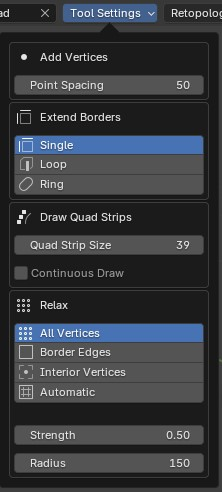

.. _tool:

##########################
Main Tool
##########################

.. image:: _static/images/main_workspace.jpg
   :alt: Workspace

With the Quad Maker tool icon selected on the left hand side of the viewport in Edit Mode, you will see a :ref:`Menu<main_menu>` along the top and the help text displaying :ref:`Keyboard Shortcuts<keyboard_shortcuts>` along the bottom.  

Selecting the *Tool* tab on the right hand side of the viewport (press the n key if tabs are not visible) will show the tool options in a longer view mode.

.. _keyboard_shortcuts:

Keyboard Shortcuts
==================

When using the tool, each :ref:`operation<operations>` has a keyboard shortcut which you press and **hold** to access.  The shortcuts are displayed along the bottom of the viewport when the Quad Maker tool is selected.  Learn about each operation :ref:`here<operations>`.

.. image:: _static/images/keyboard_shortcuts.jpg
   :alt: Keyboard Shortcuts

.. list-table:: 
   :header-rows: 1
   :widths: 15 85

   * - Key
     - :ref:`Operation<operations>`
   * - ``Hold V``
     - Add Vertices
   * - ``Hold F``
     - Fill Quads
   * - ``Hold E``
     - Extend Borders
   * - ``Hold R``
     - Quick Cut
   * - ``Hold D``
     - Draw Quad Strip
   * - ``Hold S``
     - Smooth Vertices
   * - ``Hold X``
     - Delete Mode
   * - ``Press Q``
     - Open :ref:`Pie Menu<pie_menu>` with Settings

.. _main_menu:

Top Menu
===============

These are the main controls for the Quad Maker :ref:`operations<operations>`.

------------------
Target Object
------------------

Select an object from the list if you wish to retopologize it.  This will then be used to snap new vertices, edges and faces when Blender's surface snapping is enabled through the `magnet icon <https://docs.blender.org/manual/en/3.3/editors/3dview/controls/snapping.html>`_ along the top of the viewport.  You can change this target object at any time.  

If the Target Object is not set but Blender's surface snapping is still enabled, all scene objects will be used for snapping and this may not be as fast, because the add-on will need to check all objects for the nearest surface.  If a target object is set, hiding it will have no effect on geometry snapping.

.. _tool_settings:

------------------
Tool Settings
------------------

These are the settings for all of Quad Maker's toolset.

* **Add Points**
    * **Point Spacing:** Set the size of a newly created point in pixels.
* **Extend Borders:** 
    * **Extend Mode:** Select the type of :ref:`extrude mode<extrude_modes>` you wish to use.  This will change the way edges are extruded and faces are created.
* **Draw Quad Strips:** 
    * **Quad Strip Size:** Set the size of a newly creaded quad in pixels.
    * **Continuous Draw:** If enabled, the quad strip will continue to be drawn in one continuous strip until the operation is cancelled.

* **Smooth:** 
    * **Relaxation Mode:** Select the type of :ref:`smooth mode<smooth_modes>` you wish to use.  This will change which type of vertices are smoothed.
    * **Strength:** Set the strength of the brush.
    * **Radius:** Set the size of the brush in pixels.

.. _retopology_menu:

------------------
Retopology Mode
------------------

Enable all settings for retopology in Blender including visualization settings, surface snapping and vertex auto merging.

========
Preset
========

Set all Blender retopology settings to a preset configuration which can be adjusted by clicking the small arrow next to the Apply button.  The preset settings will be remembered for next time.

* **Apply Preset**: Apply the preset Blender retopology settings.
* **Reset Default**: Reset all retopology settings to Blender's default settings.

========
Settings
========

.. image:: _static/images/retopology_menu.jpg
    :alt: Retopology Menu

* **Select Target Object**: Select the target object for snapping vertices to.
* **Use Symmetry**: Enable symmetry for the object by adding a mirror modifier.  The controls for the modifier can then be changed through this menu or via the standard modifiers panel.
* **Snap Target to individual elements**: Snap the object to individual elements of the target object.  This is useful for snapping the object to the surface of the target object.
* **Snap Target**: Snap the object to different elements of the target object.
* **Auto Merge**: Automatically merge vertices that are close together.
* **Select Modes**: Blender's selection modes for editing (vertex, edge, face).  Clicking "Enable All" will enable all modes.
* **View**: Blender's view settings for retopology in edit mode.

    * **Retopology**: Enable Blender's retopology view option which offsets the edit mesh overlay towards the view..
    * **Show Object In Front**: Always show the target object in front of the retopologized object.
    * **Show X-Ray**: Enable X-Ray mode for the target object.
    * **View Line Width**: Set the line width for Blender.

------------------
Clear Points
------------------

This option will delete all vertices that have no connected edges, which is useful if you have created multiple vertices with the `Create Vertices<place_points>` operation.

Side Tool Menu
===============

As well as containing the above settings in a longer form, the tool menu also contains the following options:

----------------
Selection
----------------

* **Highlight**: Highlight possible vertices, edges and faces that can be selected.

--------------------------------
Add Vertex on Click
--------------------------------

* **Enable**: This will automatically add single vertices when you click on the mesh.