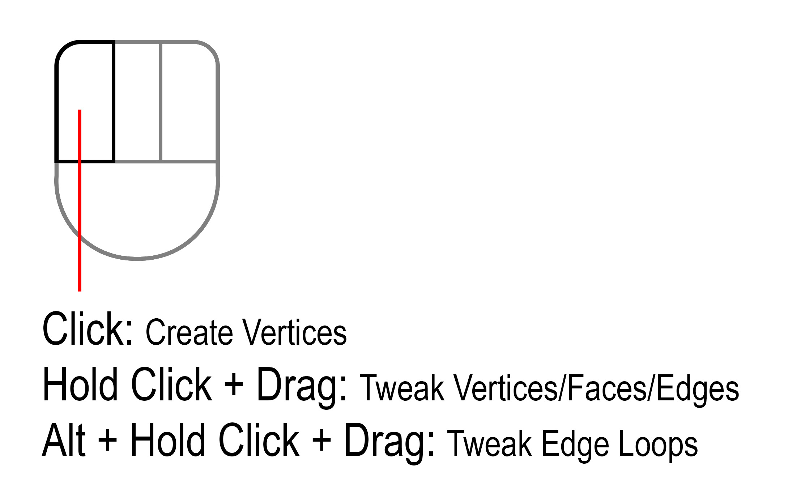

.. _tools:

#####################################
The Tools
#####################################

.. image:: _static/images/keyboard_shortcuts.jpg
   :alt: Keyboard Shortcuts
   :align: center

----------------------------------------------------------------------

.. _place_points:

---------------------------------
Create Vertices
---------------------------------

``[Left Click]``

  .. image:: _static/images/place_points.gif
     :alt: Create Vertices

  Plan ahead by placing vertices onto a target surface ready to fill with quads.

----------------------------------------------------------------------

---------------------------------
Fill Quads
---------------------------------

``[Hold F + Left Click + Drag]``

  .. image:: _static/images/fill_quads.gif
     :alt: Fill Quads

  .. image:: _static/images/fill_quads2.gif
     :alt: Fill Quads

  A tool that fills in quads between points, edges, and holes in the geometry.

  .. tip::

        Also fills trianglular holes.

        .. image:: _static/images/fill_tris.gif
            :alt: Fill Quads

----------------------------------------------------------------------

---------------------------------
Extrude Edges and Create Faces
---------------------------------

``[Hold E and Left Click + Drag]``

  .. image:: _static/images/extrude_edges.gif
     :alt: Extrude Edges

  Extrude or create new faces between edges points.

----------------------------------------------------------------------

.. _extrude_modes:

  **Extrude Modes**

  .. tip::

    Change modes in the Tool Settings to select different types of edge selections:

        .. image:: _static/images/extrude_opts_menu.jpg
            :alt: Extrude Edge Options

----------------------------------------------------------------------

  * **Single Mode** - Extrude a single edge.

    .. image:: _static/images/extrude_edges_single.gif
        :alt: Extrude Single Edge

----------------------------------------------------------------------

  * **Edge Loop Mode** - Extrude a loop of edges.

    .. image:: _static/images/extrude_edges_loop.gif
        :alt: Extrude Edge Loop

----------------------------------------------------------------------

  * **Edge Ring Mode** - Extrude a ring of edges.

    .. image:: _static/images/extrude_edges_ring.gif
        :alt: Extrude Edge Ring

    .. image:: _static/images/extrude_edge_ring_arm.gif
        :alt: Extrude Edge Ring

----------------------------------------------------------------------

  * **Create Faces** - Click near a vertex to create a face.

    .. image:: _static/images/create_faces.gif
        :alt: Create Faces

----------------------------------------------------------------------

---------------------------------
Quick Loop Cut and Slide
---------------------------------

``[Hold R + Left Click]``

  .. image:: _static/images/loop_cut_slide.gif
      :alt: Loop Cut and Slide

  Just by holding R and clicking the mouse over the edges.

----------------------------------------------------------------------

---------------------------------
Draw Quad Strips
---------------------------------

``[Hold D and Left Click + Drag]``

  .. image:: _static/images/draw_quad_strip.gif
      :alt: Draw Quad Strips

  Click and move the mouse across the mesh to create a strip of quads.  Use the mouse wheel to adjust the size of the strip.

----------------------------------------------------------------------

---------------------------------
Delete
---------------------------------

``[Hold X and Left Click + Drag]``

  Delete Faces, Edge Loops, and lone Vertices. Quickly click and drag over a mesh to delete elements by holding X:

----------------------------------------------------------------------

  * **Delete Faces** - Click and drag over faces to delete them.

    .. image:: _static/images/delete_faces.gif
        :alt: Delete Faces

----------------------------------------------------------------------

  * **Dissolve/Delete Edge Loops** - Click and drag over edge loops to dissolve them. Boundary edge loops will be deleted.

    .. image:: _static/images/delete_edge_loops.gif
        :alt: Dissolve Edge Loops

----------------------------------------------------------------------

  * **Delete Lone Vertices** - Click and drag over vertices that have no edges to delete them.

    .. image:: _static/images/delete_verts.gif
        :alt: Delete Lone Vertices

----------------------------------------------------------------------

---------------------------------
Smooth Vertices
---------------------------------

``[Hold S and Left Click + Drag]``

  .. image:: _static/images/smooth_verts.gif
      :alt: Smooth Elements

  Relax vertices whilst maintaining their projection onto the target surface.

----------------------------------------------------------------------

---------------------------------
Tweak Elements
---------------------------------

``[Left Click + Drag]``

  .. image:: _static/images/tweak.gif
      :alt: Tweak Elements

  Move vertices, edges, and faces along the mesh.  ``Hold Alt + Left Click + Drag`` to select and move edge loops.

----------------------------------------------------------------------
