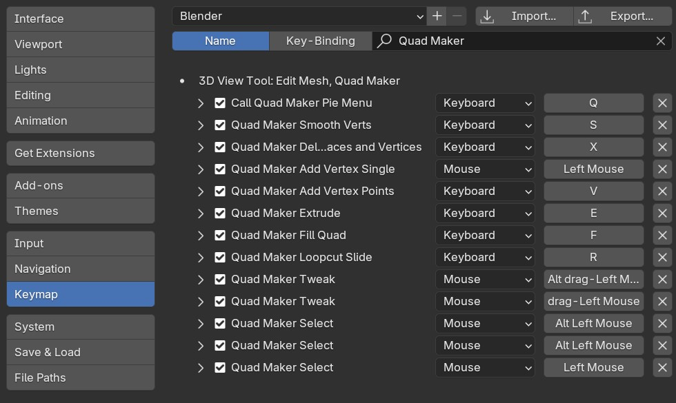

#####################################
Tips and Troubleshooting
#####################################

=========================
Frequency Asked Questions
=========================

.. note::
    
    If you are having any issues do not hesitate to :ref:`Contact Us <contact>`

----------------------------------------------------------------------------------
The :ref:`New Object with Quad Maker<new_blank_mesh>` option is greyed out.  Why?
----------------------------------------------------------------------------------

Make sure you have an object selected in Object Mode before trying to use this option.  If you have an object selected in Edit Mode, the option will be greyed out.

-----------------------------------------
Can I change the keyboard shortcuts?
-----------------------------------------

.. warning::
        
        Changing the keyboard shortcuts is not recommended as it may cause conflicts with Blender or other add-ons.  Custom keyboard shortcuts may not always work for this reason.

Go to Edit - Preferences in Blender and select the *Keymap* tab.  Search for *Quad Maker* and you will see all the shortcuts you can change.

============================================================================================================
Retopology Resources
============================================================================================================

Here are some free and paid resources for learning more about retopology. There are many, many more:

* Pixar's retopology modelling tips - https://graphics.pixar.com/opensubdiv/docs/mod_notes.html

* Topology Guides - https://topologyguides.com/

* Optimal Edge Loop Reduction Workflows - https://topologyguides.com/loop-reduction

* Blender Studio's Retopology Course - https://studio.blender.org/training/stylized-character-workflow/chapter/5d384edea5b8f5c2c32c8507/

