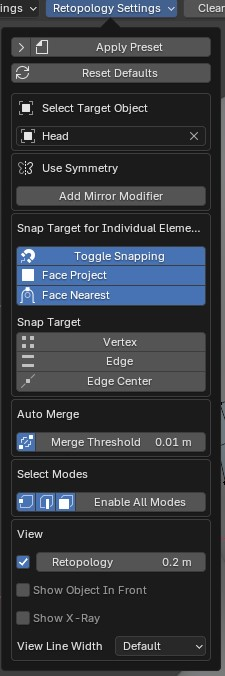

.. _workspace:

##########################
Workspace
##########################

With Quad Maker selected on the left hand side of the viewport in Edit Mode, you will see the :ref:`Main Menu<main_menu>` along the top and the help text displaying :ref:`Keyboard Shortcuts<keyboard_shortcuts>` along the bottom.

.. _main_menu:

Main Menu
===============

These are the main controls for the Quad Maker Tools.

.. tip::

    .. image:: _static/images/main_menu_side.jpg
        :alt: Main Menu

    You can also view a long version of this menu whilst using Quad Maker by selecting the *Tool* side tab (press the n key).

Target Object
------------------

Select the object you wish to retopologize.  This will then be used to snap new vertices, edges and faces to the surface of the target object.  You can change this target object at any time.

------------------
Retopology Mode
------------------

Enable all settings for retopology in Blender including visualization settings, surface snapping and vertex auto merging.  Defaults can be set in the add-on preferences section.  

* The **Set All** and **Reset All** buttons will set all retopology settings or reset them to Blender's default settings.
* The **Enable All Modes** button will automatically set selection mode to vertices, edges and faces all at the same time.

------------------
Tool Settings
------------------

These are the settings for all of Quad Maker's toolset.

.. image:: _static/images/tool_settings_menu.jpg
    :alt: Tool Settings

* **Tweak:**
    * **Select only unselected:**  If ticked, this will behave like Blender's default tweak where new elements are only selected is they are new.  Otherwise, a new selection will be made every time.
* **Quad Strips:** 
    * **Strip Size:** Set the size of a newly creaded quad in pixels.
* **Extrude:** 
    * **Extrude Mode:** Select the type of :ref:`extrude mode<extrude_modes>` you wish to use.  This will change the way edges are extruded and faces are created.
* **Relax:** 
    * **Relaxation Mode:** Select the type of relaxation mode you wish to use:

        * **All Vertices:** Relax all vertices.
        * **Border Vertices:** Relax only border vertices.
        * **Interior Vertices:** Relax only interior vertices.
        * **Automatic:** Automatically relax vertices based on the initial selection.  if the initial selection is an interior vertex, only interior vertices will be relaxed. If the initial selection is a border vertex, only border vertices will be relaxed.

* **Snap Modes:** for each action, you can choose which type of target object snapping behaviour you wish to use:

    * **Face Project**: Vertices are projected onto the face of the target object in the direction of the view.
    * **Face Nearest**: Vertices are snapped to the nearest face of the target object.

------------------
Analyse Mesh 
------------------

Analyse the mesh for the number of tris, quads and ngons, as well as the number and type of edge poles.  

Click **Analyse Mesh** to run the analyses, and **Re-Analyse Mesh** to update the results.  

Pressing the **Select** button next to each item will select the relevant item. Press *Ctrl* whilst doing this to add to the existing selection.

* **Vertices:** The number of vertices in the mesh.
* **Edges:** The number of edges in the mesh.
* **Faces:** The number of faces in the mesh.
* **Tris:** The number of triangles in the mesh.
* **Quads:** The number of quads in the mesh.
* **Ngons:** The number of ngons in the mesh.
* **n-Poles:** The number vertices with *n* connected edges.

------------------
Clear Points
------------------

This option will delete all vertices that have no connected edges, which is useful if you have created multiple vertices with the `Create Vertices<place_points>` operation.

.. _keyboard_shortcuts:

Keyboard Shortcuts
==================

The bottom part if the view displays all main keyboard shortcuts for the :ref:`Quad Maker tool set<toolset>`.  These will change depending on the type of sub tool you are using.

